# OX Mallorca Notes

## Prerequesists:

- Homebrew
- Docker
- Linux / MacOS / WSL

## Minikube

If you don't have a Kubernetes cluster running, you can use Minikube to use Docker containers as nodes.

1. Go to [Minikube Installation](https://minikube.sigs.k8s.io/docs/start/)
2. Pick the right OS and arcitecture for your system
3. Run "minikube start"

## Kubectl

You need a way to interact with your Kubernetes cluster.

- Go to [Kubernetes docs](https://kubernetes.io/docs/tasks/tools/install-kubectl-linux/) to download kubectl.

## FluxCD

### Setting up FluxCD (GitHub)

1. First, install the FluxCD CLI: `brew install fluxcd/tap/flux`

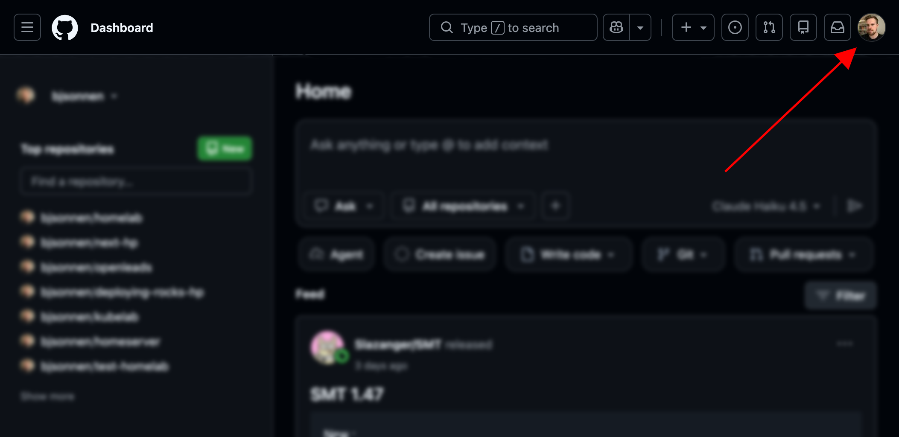
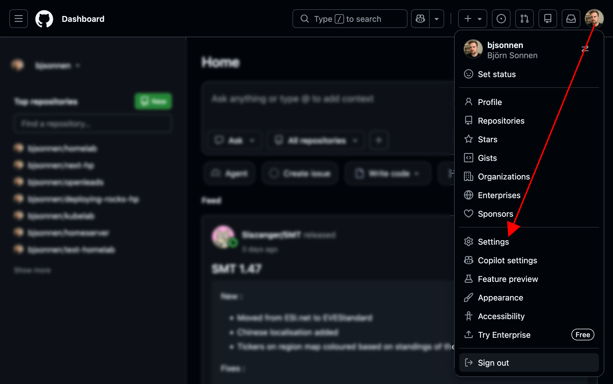
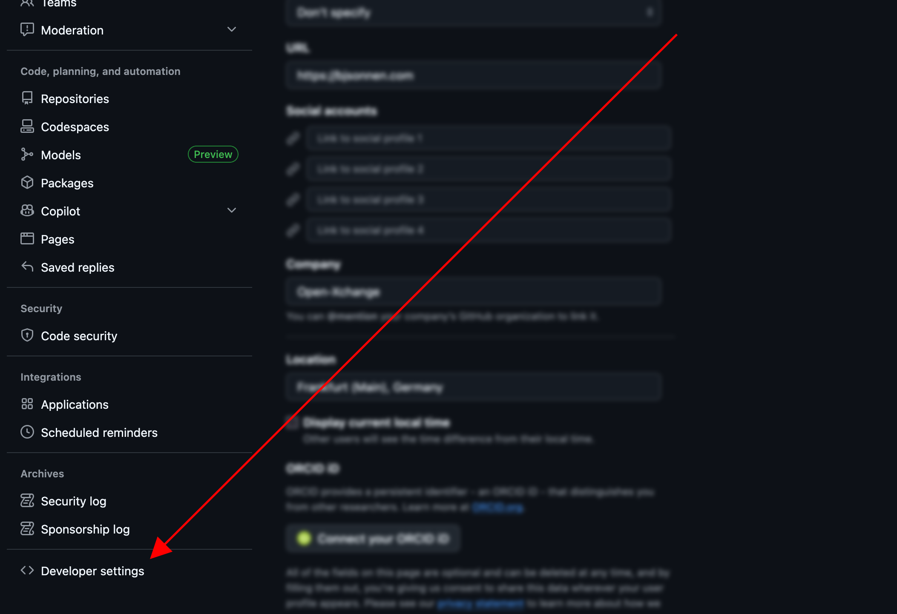
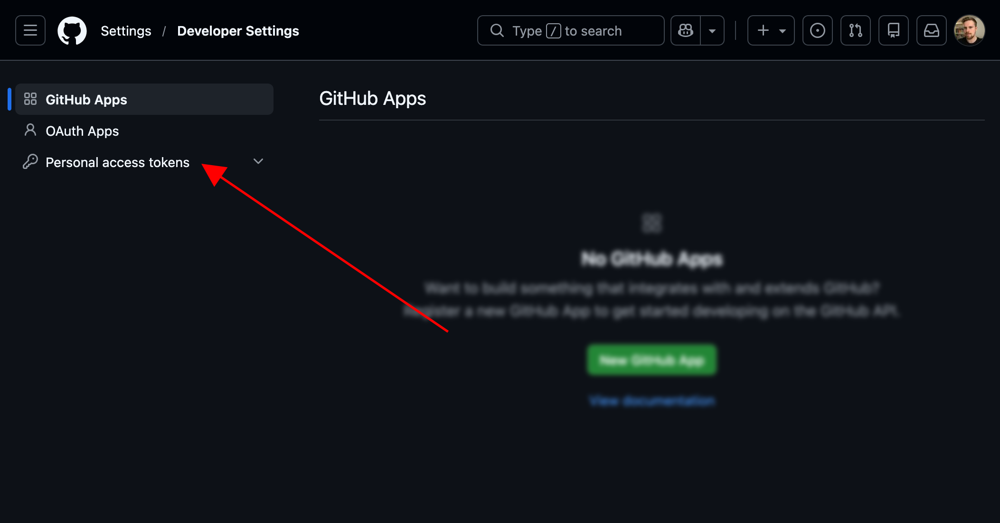
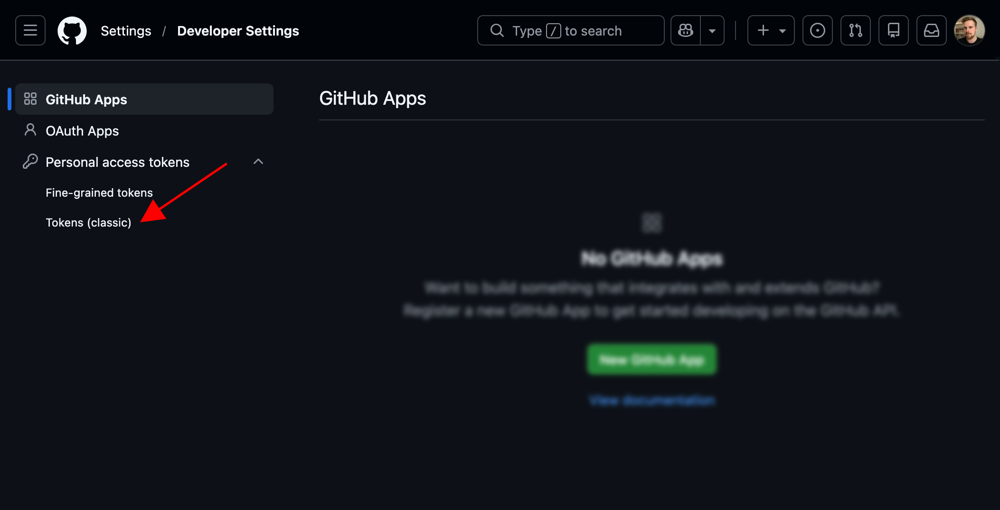
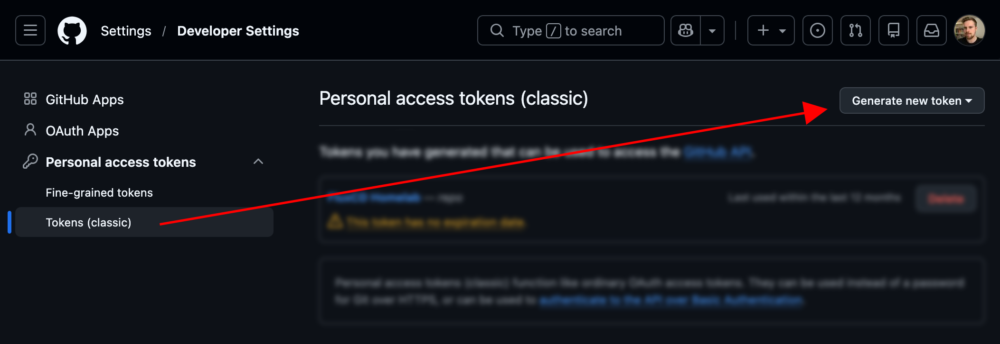
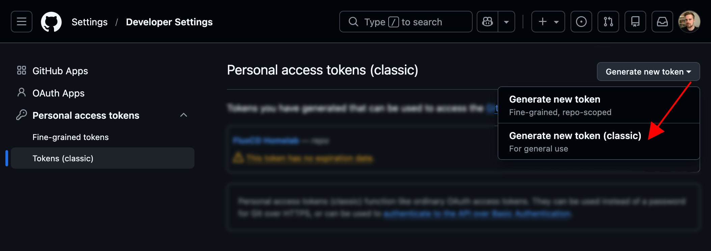
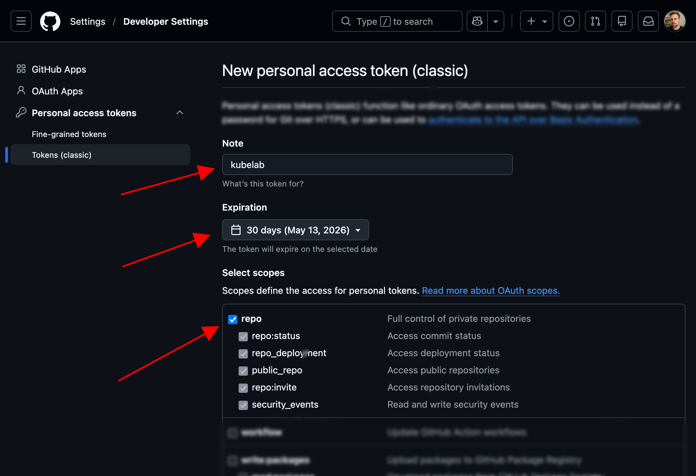
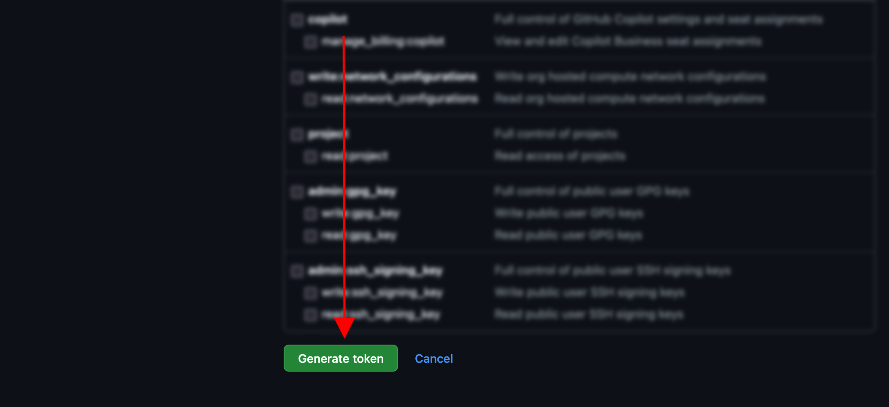
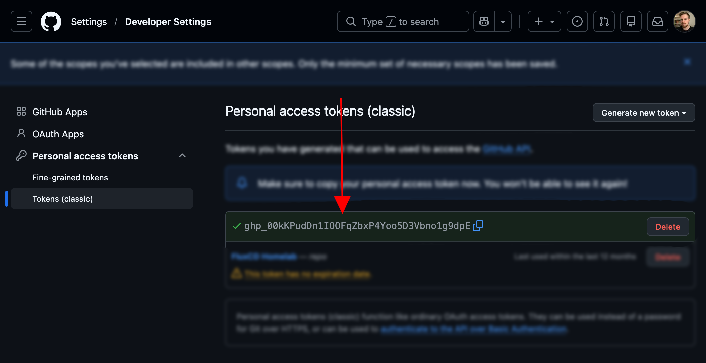

3. Export that GitHub token via `export GITHUB_TOKEN=<token>`
4. Run this command to bootstrap Flux: `flux bootstrap github --owner=<username> --repository=<repo> --branch=main --path=./clusters/staging --personal`
    - This will install FluxCD onto the Kubernetes cluster.
    - This will create a git repo called "<repo>" under your username.

### Setting up FluxCD (Gitlab)

1. First, install the FluxCD CLI: `brew install fluxcd/tap/flux`

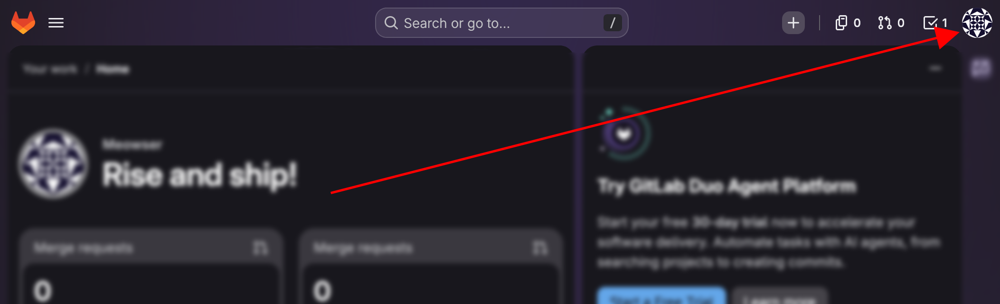
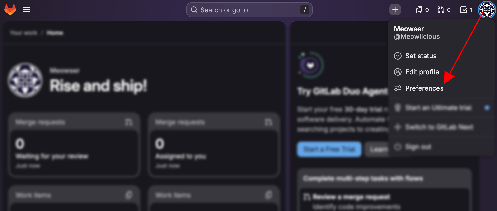
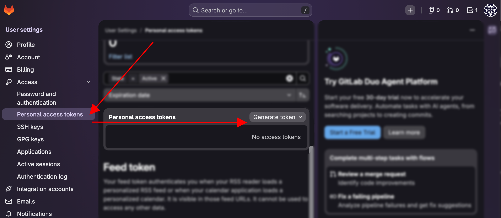
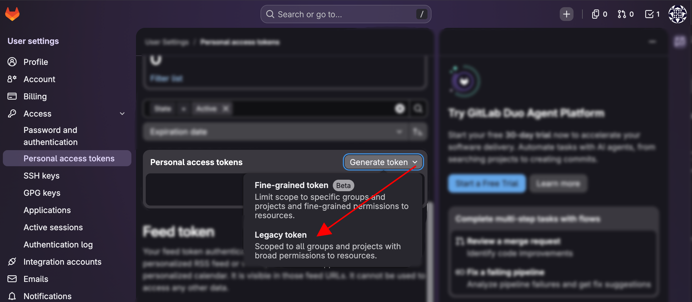
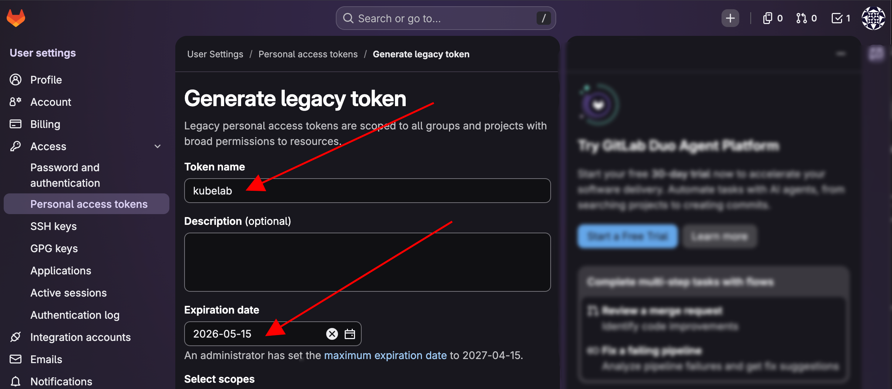
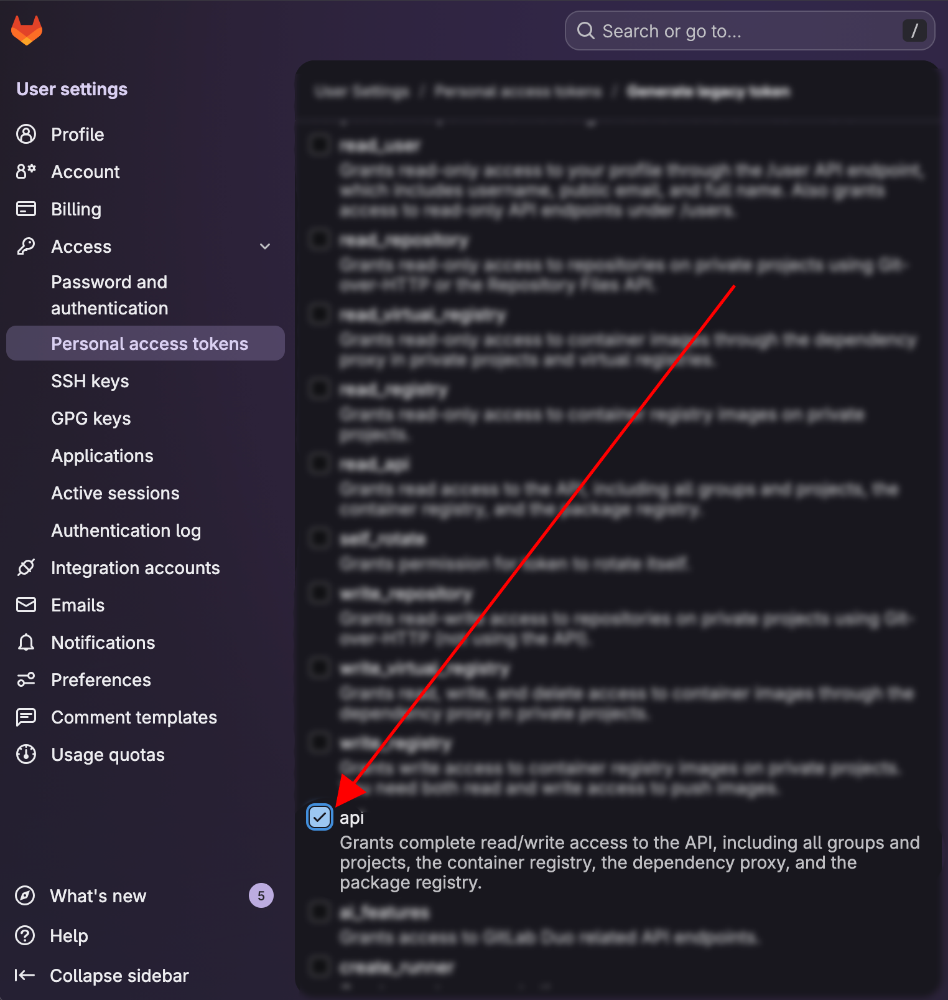
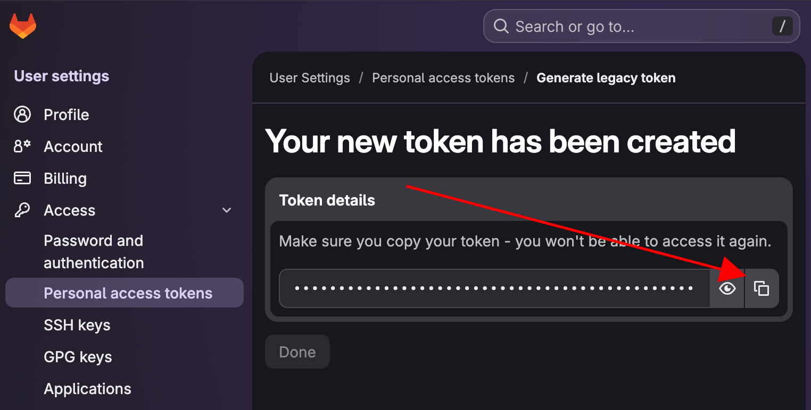

3. Export that Gitlab token via `export GITLAB_TOKEN=<token>`
4. Run this command to bootstrap Flux: `flux bootstrap gitlab --deploy-token-auth --owner=<username> --repository=<repo> --branch=master --path=clusters/my-cluster --personal`
    - This will install FluxCD onto the Kubernetes cluster.
    - This will create a git repo called "<repo>" under your username.

### Configuring the git repo

1. Clone your new repo: `git clone git@github.com:<user>/<repo>.git`
2. Create a new directory inside it via `mkdir -p ./apps/staging`
    - This will be the folder where we'll add the apps later.
3. Create this FluxCD config file: `flux create kustomization apps --source=flux-system  --path="./apps/staging" --prune=true --interval=1m --retry-interval=1m --export > ./clusters/staging/apps.yaml`
    - This will tell FluxCD to look into the "./apps/staging" folder for things to apply.

## LinkDing

### LinkDing Installation

1. First, create a directory for LinkDing: `mkdir ./apps/staging/linkding`
2. Next, create the Kubernetes manifest file for the deployment: `kubectl create deployment linkding --namespace linkding --replicas 1 --image=sissbruecker/linkding:latest --dry-run=client -o yaml > ./apps/staging/linkding/deployment.yaml`
3. Next, create the Kubernetes manifest file for the namespace: `kubectl create namespace linkding --dry-run=client -o yaml > ./apps/staging/linkding/namespace.yaml`
4. Next, create a Kustomize file with `touch ./apps/staging/linkding/kustomization.yaml` to tell FluxCD to apply these two manifest files:
```
apiVersion: kustomize.config.k8s.io/v1beta1
kind: Kustomization
resources:
  - deployment.yaml
  - namespace.yaml
```
5. Commit everything to git.
6. You can use `kubectl get pods -A --watch` for thing to pop up.
    - If you're having problems, run `flux get kustomization apps` to see the status of the last applied commit.
    - If you feel like it didn't pull it yet, force it via `flux reconcile kustomization apps`
7. Once the pod is up and running, run `kubectl port-forward --namespace linkding linkding-<id>-<id> 9090:9090`, then navigate to `localhost:3000`.

### LinkDing Admin User

1. To create an admin user via a secret, run `kubectl create secret generic linkding-secret --namespace linkding --from-literal=LD_SUPERUSER_NAME=admin --from-literal=LD_SUPERUSER_PASSWORD=1234 --dry-run=client -o yaml > ./apps/staging/linkding/secret.yaml`
2. Change the Kustomization file to include the secret.yaml file with `vim ./apps/staging/linkding/kustomization.yaml`
```
apiVersion: kustomize.config.k8s.io/v1beta1
kind: Kustomization
resources:
  - deployment.yaml
  - namespace.yaml
  - secret.yaml
```
3. Change the deployment.yaml file with `vim ./apps/staging/linkding/deployment.yaml` to use the secret:
```
apiVersion: apps/v1
kind: Deployment
metadata:
  labels:
    app: linkding
  name: linkding
  namespace: linkding
spec:
  replicas: 1
  selector:
    matchLabels:
      app: linkding
  strategy: {}
  template:
    metadata:
      labels:
        app: linkding
    spec:
      containers:
      - image: sissbruecker/linkding:latest
        name: linkding
        resources: {}
        envFrom:
          - secretRef:
              name: linkding-secret
status: {}
```

## Using SOPS

### Understanding the problem

1. Check out our secret.yaml file: `cat ./apps/staging/linkding/secret.yaml`
2. Copy the value of the secret's values and put them into this command `echo 'STRING HERE' | base64 --decode`.

### Using SOPS

1. Install the sops and age cli: `brew install age sops`
2. Generate a public and private key using age: `age-keygen -o age.agekey`
3. Encrypt the secret using the age public key `sops --age=<public key> --encrypt --encrypted-regex '^(data|stringData)$' --in-place ./apps/staging/linkding/secret.yaml`
4. Then, print out the secret.yaml file again: `cat ./apps/staging/linkding/secret.yaml`

### Making FluxCD use SOPS

1. Change our "apps.yaml" file inside via `vim ./clusters/staging/apps.yaml` folder to the following:
```
apiVersion: kustomize.toolkit.fluxcd.io/v1
kind: Kustomization
metadata:
  name: apps
  namespace: flux-system
spec:
  interval: 1m0s
  path: ./apps/staging
  prune: true
  retryInterval: 1m0s
  sourceRef:
    kind: GitRepository
    name: flux-system
  decryption:
    provider: sops
    secretRef:
      name: sops-age
```
    - The last four lines are the important ones. They tell FluxCD to use SOPS and use the Kubernetes secret "sops-age" as the decryption key. This will be the private key.
2. Create a ".sops.yaml" file with `vim ./clusters/staging/.sops.yaml` folder with the following:
```
creation_rules:
  - path_regex: .*.yaml
    encrypted_regex: ^(data|stringData)$
    age: <public key>
```
    - This tells FluxCD which files and what lines to look out for.
3. Finally, create a Kubernetes secret that includes the private key. Do not create it by uploading it, but by adding it manually. `kubectl create secret generic sops-age --namespace=flux-system --from-literal=age.agekey=<private key>`
4. Commit everything, except the "age.agekey".
5. Once everything is recreated, run `kubectl port-forward --namespace linkding linkding-<id>-<id> 9090:9090` once more and log-in.